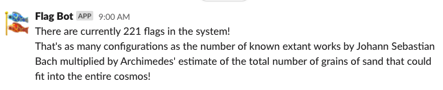
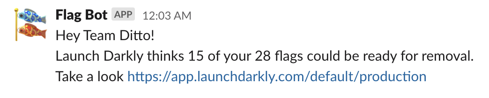

# Flag Counter

Messages scheduled updates about active LaunchDarkly flags 

Serverless AWS Lambda Function built with Gradle

Built from [this template](https://github.com/serverless/serverless/tree/master/lib/plugins/create/templates/aws-kotlin-jvm-gradle-kts) using serverless

# How it Works

The Flag Counter runs weekly by default to pull a count of the LaunchDarkly flags that you have in your system and post that count to Slack. 
It adds a small sentence to help visualize the large number of configurations that can result from even a handful of flags. 
The goal of this project is to help motivate your team to remove unused flags from your system to reduce the number of potential configurations of your application.

## Example Slack Message

On a preset schedule, your whole team will get a message similar to the one below.

 

The string that is included will preferentially pick a single number out of the map in [the Generator](src/main/kotlin/com/procurify/flagcounter/FlagEquivalentMessageGenerator.kt).

If a single number can't be found then two numbers will be multiplied together as in the message above.

You can also configure individual teams to receive a message with more detailed information about the flags they maintain.

  

# How to Deploy

## Setting up your environment

1. Configure [serverless](https://github.com/serverless/serverless) on your machine to deploy the Flag Counter.

2. Create a `Reader` access token for your LaunchDarkly account [here](https://app.launchdarkly.com/settings/authorization). Export the token as an environment variable named `LAUNCHDARKLY_KEY`

3. Install an `Incoming Webhooks` from the Slack [App Directory](https://slack.com/apps/A0F7XDUAZ-incoming-webhooks) and configure it to the channel you want to see the main flag count update in. Export the `Webhook URL` as an environment variable named `SLACK_URL`

4. Install an `Incoming Webhooks` from the Slack App Directory and configure it to the channel you want to see any error messages in. Export the `Webhook URL` as an environment variable named `SLACK_ERROR_URL`

5. If you would like to notify individual teams of the number of flags that they own (are the maintainer for), create a JSON object which maps the team's email address used in LaunchDarkly to the `Webhook URL` for the team. For example, to configure two teams
```json
{
  "teamsList": [
    {
      "email":"firstTeam@company.com",
      "url": "<slack webhook url>"
    },
    {
      "email":"secondTeam@company.com",
      "url":"<slack webhook url>"
    }
  ]
}
```

This object should be stored as a string and exported as an environment variable called `TEAMS_MAP`

```
export TEAMS_MAP='{"teamsList":[{"email":"firstTeam@company.com","url":"<slack webhook url>"},{"email":"secondTeam@company.com","url":"<slack webhook url>"}]}' 
```

6. If you would like a specific schedule for your team to be sent notifications, you can define this schedule following the [AWS schedule syntax](https://docs.aws.amazon.com/AmazonCloudWatch/latest/events/ScheduledEvents.html), and export it as an environment variable named `SCHEDULE`. The default schedule for notifications will be once weekly on Mondays at 17:00 UTC.

## Build the JAR

### Build using local machine
1. Ensure that you have Java installed on your machine.
2. Run `make build` which will invoke gradle, run the tests, and build the JAR

### Build using Docker
1. `make docker-save`
2. jar files will be saved to the build folder.

## Deploy to AWS

If you want to deploy to a different region than `us-west-2` you can change this in [serverless.yml](serverless.yml)

If you want to change the cron scheduling of the flag update you can change this in [serverless.yml](serverless.yml). You will need to describe your schedule using AWS [Schedule Expressions](https://docs.aws.amazon.com/AmazonCloudWatch/latest/events/ScheduledEvents.html)

1. Run `make deploy` which will invoke serverless and deploy your function.

2. To ensure that the deployment was successful, you can view your AWS Lambda function in the AWS Console and trigger it manually with a test event.
 

